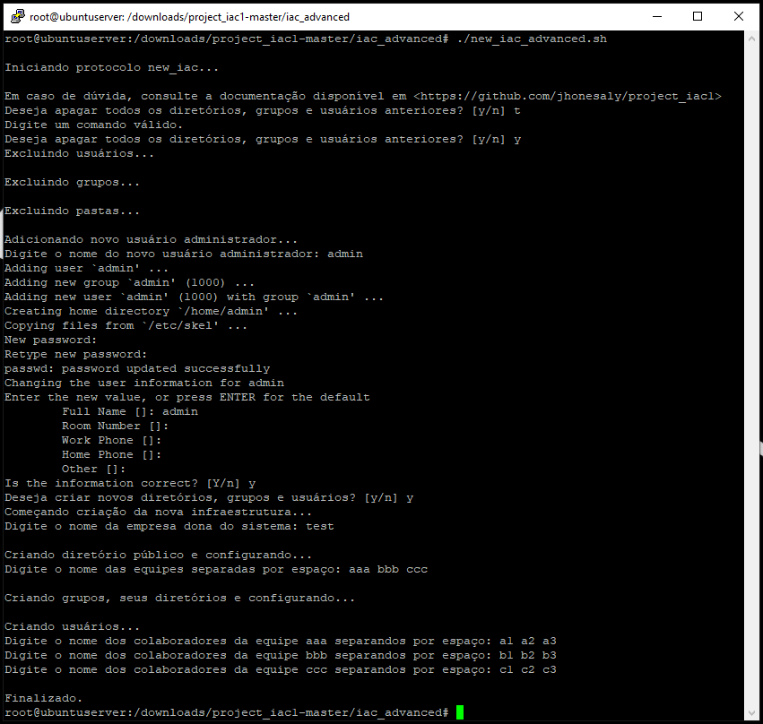
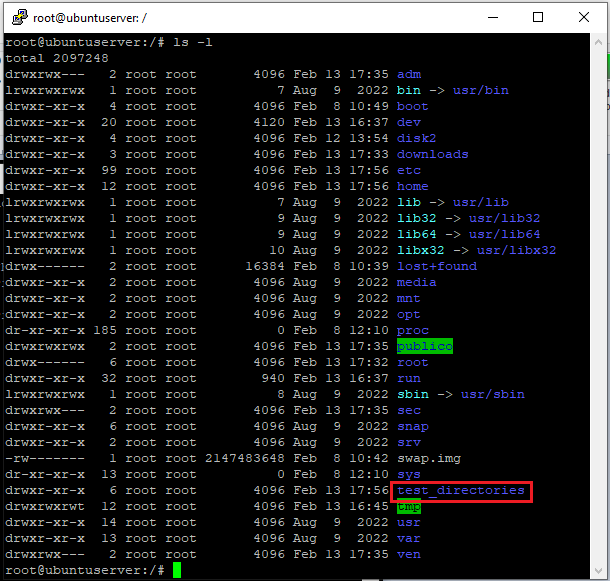
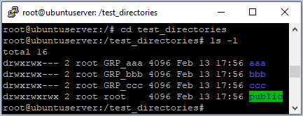
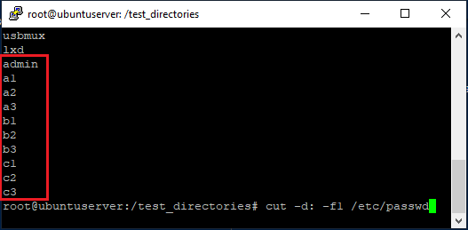
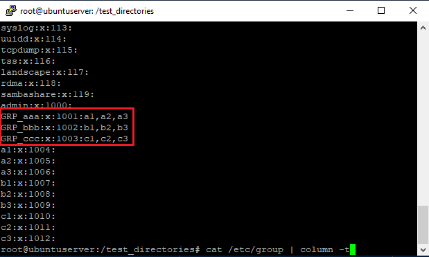

# iac_advanced

Nessa pasta está contida o script avançado, que utiliza lógica para permitir a generalização do script básico, permitindo que seja criado quaisquer pastas, usuários e grupos direto na linha de comando de maneira muito mais simplificada. 

Além disso, também é implementado o algoritmo que permite a exclusão de todas as pastas, grupos e usuários anteriores, se for de interesse do administrador. 

Tudo isso utilizando uma estrutura modularizada que permite maior flexibilidade e mais implementações no futuro.

Para tal, basta executar o script "new_iac_advanced.sh", que puxará automaticamente os módulos necessários da pasta "modules".

Esse script é um arquivo de script Bash que tem como objetivo automatizar a criação de diretórios, grupos de usuários e permissões em um sistema Linux de maneira simples conforme pedido.

------
# Explicando Script new_iac_advanced

Este código shell é chamado new_iac e tem como objetivo excluir diretórios, grupos e usuários antigos e criar novos em um sistema.

Em 0, ele imprime uma mensagem de saudação na tela.

Em 1, o código chama o script "exclude_past_gud.sh" para excluir antigos diretórios, arquivos, grupos e usuários anteriores (veja a seção a seguir: "Explicando Script exclude_past_gud.sh").

Em 2, o código chama o script "create_new_gud.sh" para criar novos diretórios, grupos e usuários (veja a seção a seguir: "Explicando Script create_new_gud.sh").

Em ambos os casos, o código solicita ao usuário que confirme se deseja realizar a ação e, em seguida, executa o script correspondente ou finaliza o programa, caso o usuário opte por não executar a ação.

Finalmente, em 3, o código exibe uma mensagem de conclusão na tela.

## Explicando Script exclude_past_gud.sh

Este é um script que realiza algumas operações de limpeza e configuração do sistema.

O termo "gud" vem de "grupos, usuários e diretórios".

Em 0, o script exclui todos os usuários que não sejam "root". Isso é feito em um loop for que percorre todos os diretórios em /home. Se o usuário não for "root", o comando userdel é executado com a opção "-rf" para excluir o usuário e todos os seus arquivos.

Em 1, o script exclui todos os grupos com um ID entre 1000 e 1100 (supõe-se que não foram criados mais que 100 grupos anteriormente). Isso é feito usando o comando cut para extrair o nome de cada grupo do arquivo /etc/group e, em seguida, obtendo o ID do grupo usando o comando getent. Se o ID do grupo estiver dentro do intervalo especificado, o comando groupdel é usado para excluí-lo. O grupo "sync" é ignorado.

Em 2.1, o script procura um diretório que contenha o texto "_directories" em seu nome. 

Em 2.2, verifica se algum foi encontrado

Em 2.3, caso tenha encontrado, o exclui usando o comando "rm -rf". 

Em 2.4, exclui todos os diretórios do usuário em /home.

Em 3, O script adiciona um novo usuário administrador, que é solicitado pelo usuário usando o comando read. O comando adduser é usado para adicionar o usuário e o comando usermod é usado para adicioná-lo ao grupo "sudo"

## Explicando Script create_new_gud.sh

Este é um script que cria a nova infraestrutura básica para uma empresa.

Em 0, o script começa imprimindo uma mensagem na tela de saudação e solicitando ao usuário que digite o nome da empresa dona do sistema.

Em 1, ele cria um diretório com o nome da empresa digitado pelo usuário.

Em 2, ele cria o diretório público dentro do diretório da empresa, define o proprietário para root, e define permissão 777 para o diretório público.

Em 3, ele solicita que o usuário digite os nomes das equipes separados por espaço, e em seguida, cria diretórios para cada equipe, cria um grupo com nome prefixado por GRP_ para cada equipe, altera o proprietário para root e o grupo correspondente e define permissão 770 para cada diretório criado.

Em 4, para cada equipe, ele solicita que o usuário digite os nomes dos colaboradores separados por espaço, e em seguida, cria um usuário para cada colaborador, colocando-os no grupo correspondente, e definindo uma senha criptografada para cada um.

------
# Output do script:

Prompt:

Pastas:

Usuários:

Grupos:

