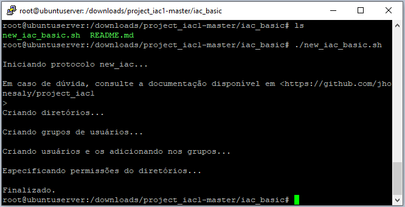
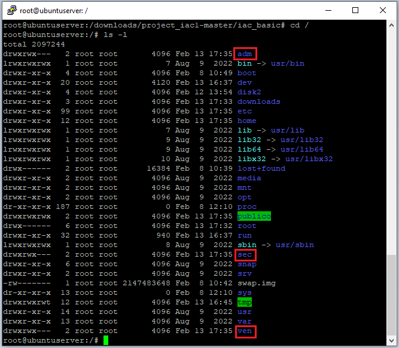
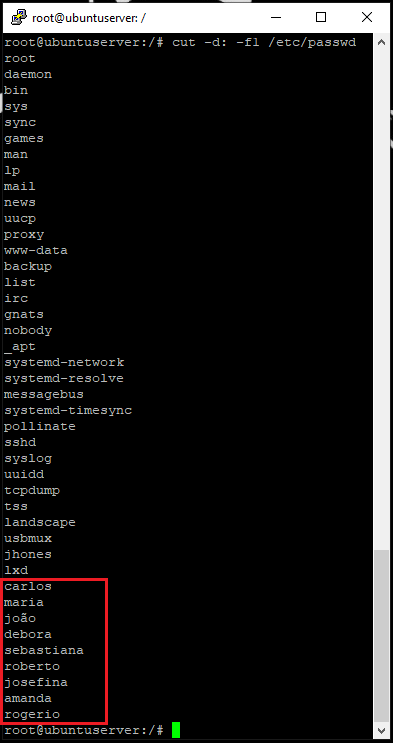
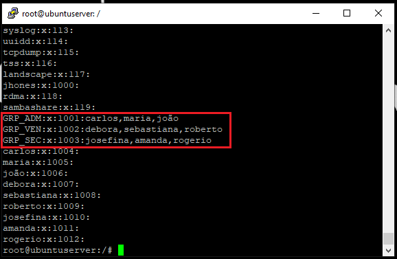

# iac_basic

Nessa pasta está contida o script que seguirá estritamente aquilo que foi proposto pelo desafio, criando somente as pastas, usuários e grupos descritos nos requerimentos. 

Para tal, basta executar o script "new_iac_basic.sh".

Esse script é um arquivo de script Bash que tem como objetivo automatizar a criação de diretórios, grupos de usuários e permissões em um sistema Linux de maneira simples conforme pedido.

------
# Explicando Script new_iac_basic

Em 0, o script começa imprimindo uma mensagem na tela e informando que a documentação está disponível em um determinado local.

Em 1, ele cria quatro diretórios, nomeados como /publico, /adm, /ven e /sec.

Em 2, ele cria três grupos de usuários: GRP_ADM, GRP_VEN e GRP_SEC.

Em 3, ele cria nove usuários com senhas criptografadas, adicionando cada um em seu respectivo grupo. Os nomes dos usuários são Carlos, Maria, João, Debora, Sebastiana, Roberto, Josefina, Amanda e Rogerio.

Em 4, ele especifica as permissões de acesso para cada um dos diretórios criados.

Em 5, ele altera o proprietário de todos os diretórios para o usuário root

Em 6, concede permissões a todos os usuários dentro do diretório publico. 

Em 7, são concedidas permissões aos usuários dentro de seus respectivos diretórios.

Por fim, em 8, uma mensagem de conclusão é exibida na tela.

------
# Output do script:

Prompt:

Pastas:

Usuários:

Grupos:

